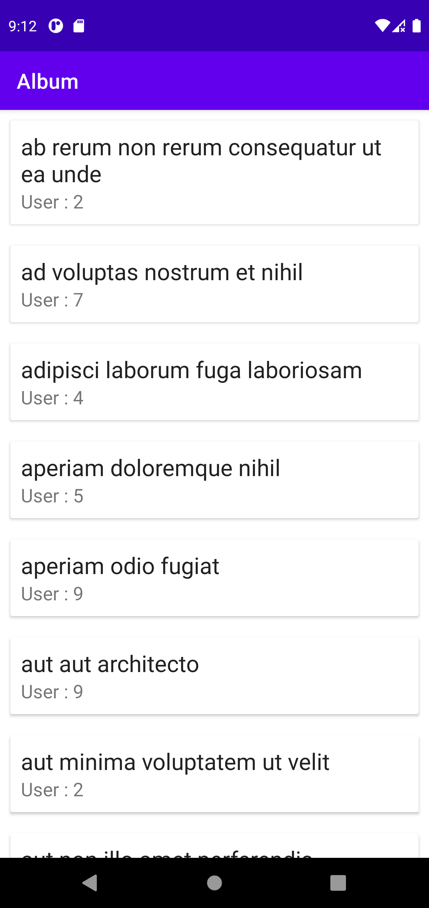

# Album

## Overview

This application has following features

* User can able see to list of albums in sorted order by title
* User can see albums list in offline mode
* User can able see to list of Albums with following details
    1. Album Title
    2. User Id

Used single activity to handle application features

1. AlbumActivity - Holds the list of albums and display to the user
3. AlbumViewMode - Mediator between domain/data layer and UI layer to hold the data which suppose to
   load and display on the screen
4. Dependency Injection Modules - Provides the single instance dependency of Retrofit, room database
   throughout the application. Provides the instances of ViewModel, Use cases, repositories to the
   caller
5. Mapper - Used to map response, models and entity in different layers and send to the UI

### Artifact



## Programming Language

- Kotlin

## Development Environment

1. Android Studio Arctic Fox 2020.3.1
2. JDK 11
3. Gradle Plugin Version – 7.0.0
4. Gradle Build Version – 7.0.2.bin
5. MIN Android SDK – 24
4. JUnit4 Test Framework

## Architecture Overview

Making use of Clean Architecture and MVVM to handle 1.Separation of concern 2.Making code easily
testable and maintainable 3.Easy for Dependency injection

### Clean Architecture and MVVM


**Presentation Layer**
This includes applications Activities,Fragments and ViewModels, Adapters etc.

- **Views**  
  Responsible for displaying and responding to user actions. Reacts to data changes from the View
  Model.

- **View Models**  
  Responsible for exposing and preparing data to be presented by a View. Exposes observables for
  Views to react to. It should not hold any reference to any View.

**Domain Layer**
Contains all the use cases of application which holds the business actions

- **Use Cases**  
  Responsible for encapsulating a specific business action, performs integration and orchestration
  with the data layer, and mapping between entity and data models.

**Data layer**
To have 1 or multiple implementations of the Domain's interfaces and to bind the interface with the
actual implementation

- **Repositories**  
  Returns data from data source either from Remote Service or Local Storage

- **Remote Services / Local Storage**  
  Responsible for serving as an access point to external data layers and persistence.

## Libraries Used

* Coroutines - a great way to write asynchronous code that is perfectly readable and maintainable
* Koin - A pragmatic lightweight dependency injection framework for Kotlin developers to whom we
  will give the responsibility to instantiate the different objects of our application
* Mockito - Mocking framework for unit test cases.Mockito is used to mock interfaces so that a dummy
  functionality can be added to a mock interface that can be used in unit testing.
* Retrofit - It manages the process of receiving, sending, and creating HTTP requests and responses.
* Room - To cache relevant pieces of data so that when the device cannot access the network, the
  user can still browse that content while they are offline.

## Test Cases

Created test cases for following classes to validate business logic and integration of different
components and modules or layers

1. AlbumRepositoryTest
2. GetAlbumUseCaseTest
3. AlbumViewModelTest

## Recommendations

**Use Pagination**

* Albums api returns more than 90+ records so in case of huge dataset there might be lags in the
recyclerview and it might end up with ANR so to avoid this we can use pagination to load more
elements once scrolling reaches to end of the list will keep loading next set of elements from api
or from local db.
* As per my observation albums api is returning set of albums those belongs specific user (say userId
1 has 10 albums and UserId 2 has again 10+ albums and so on).
*So in order to accommodate pagination or load more feature we can make use of another api which
will return us set of albums for specific user. e.g We can make use of following api to get albums
of specific user
https://jsonplaceholder.typicode.com/users/1/albums

 ```json
  [
  {
    "userId": 1,
    "id": 1,
    "title": "quidem molestiae enim"
  },
  {
    "userId": 1,
    "id": 2,
    "title": "sunt qui excepturi placeat culpa"
  },
  {
    "userId": 1,
    "id": 3,
    "title": "omnis laborum odio"
  }
]
```

**Use Expandable Recycler view**
* In the current approach/implementation we are storing data in local db.Here idea is to fetch
records on need basis. Inside recycler view(list) when user clicks on card then will fetch the
albums records from local db for that specific user and populate on the screen in sorted order by
expanding that card.

**Use of DiffUtil.Callback instead of notifyDataSetChanged()**

* If we consider first recommendation then we need to keep changing the data set frequently of the
recycler view. When the content of list gets changed, we have to call notifyDataSetChanged() to get
the updates but it is very costly. There are so many iterations for getting the job done in the case
of notifyDataSetChanged(). DiffUtil.Callback is an abstract class and used as callback class by
DiffUtil while calculating the difference between two lists.DiffUtil updates only those rows that
are different between the Lists of values.This recommendation directly impacts on performance of
list.

**Add login feature**

* We can add one more screen to authenticate and manage user session. Recommending this because when
user will come to the home screen after login he will be able to see list of albums those are
belongs to him only.

**Add album image url(say imgUrl) as new parameter in response**

* A picture is worth a thousand words


**Search Albums from list**
Provide search bar on list screen to search album from the list

## Please Note

1. Haven't used DiffUtil.Callback because application loading data only once from api and not
   refreshing list frequently hence preferred notifyDataSetChanged()
